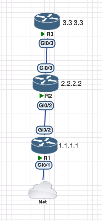
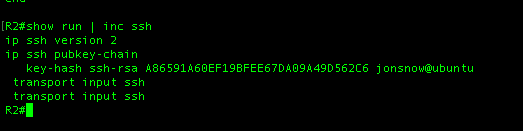
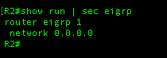
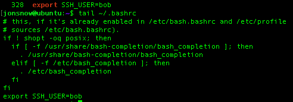
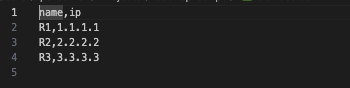
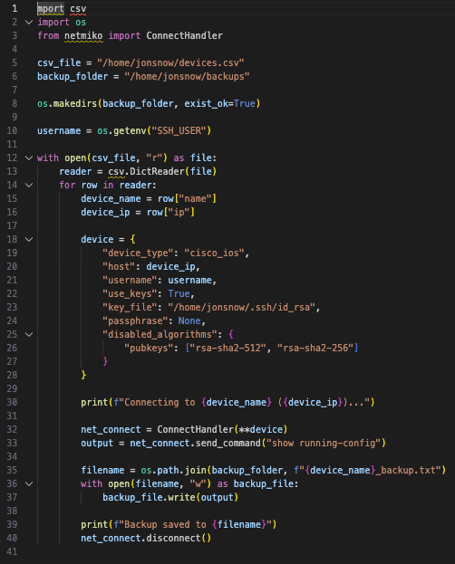
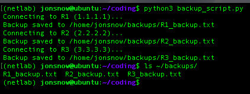
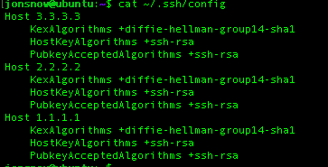

# Automation Lab using Python

This repository documents a small lab where a simple python script is used to backup three cisco routers running in a PNETLabs enviroment. The aim of this repository is to showcase automation capabilities and document my personal experience with it.

---

## Lab Setup & Prerequisites

- PNETLabs
- 3x Cisco routers 
- Ubuntu VM 
- Reachability between routers and Ubuntu VM
- SSH configuration on Routers and Ubuntu VM
- Netmiko installed
- CSV file for device info

---

## Lab Topology

---

## Routers 

- Each router, has identical configuration for SSH 

- As I wanted to use SSH keys for passwordless authentication, I added the public key from the Ubuntu VM to each of the routers

- Eigrp was used to exchange routes between the routers

   

- Loop 0 was configured and used to reach the routers.

---

## Ubuntu VM

- SSH keys were generated that would allow the script to use passwordless authentication

- An environment variable was configured and added to .bashrc to store the username. This avoids hardcoding the username in the script or using the input() function.

- I installed netmiko in a venv however, it can also be installed in the global python
- A CSV was created containing the information for routers

- Created a python file with the following code:

---

## Script execution & result

- Ran the script on the Ubuntu VM and confirmed its success

---
## Notes  

- A lot of the things i have done in this lab can be done differently
- For example, you can use the input() and getpass() function for the SSH
- You can use a list for the routers instead of the CSV file
- The routers did not have enable secret password configured
- I just did it in this way as i wanted to experience if the routers were capble of Key based authentcation and how CSV files with python
---

## Troubleshooting

- Alot of issues were encountured during this lab
- The Cisco routers only supported older legacy RSA keys, which caused issues with the Ubuntu VM because modern SSH does not allow these keys by default
- Fixed this by creating a custom ssh config file which allowed the older legacy keys for the specific routers

- Initially, I used 2048-bit RSA keys for the Ubuntu VM, but this caused compatibility issues with the routers. The problem was resolved by using 1024-bit keys
- Manual SSH from the terminal worked, but SSH via Netmiko initially failed
- Issue was fixed by adding the "passphrase" and "disabled_algorithms" keys in the dictionary